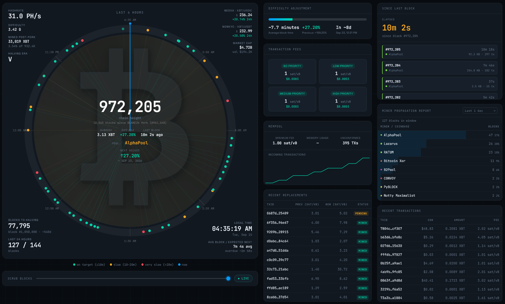

# XBT Clock

<p align="center">
  
</p>

A live single-page dashboard for **Bitcoin BLAKE2b (XBT)** — the BIP-110 hardfork that split from the compromised Spamcoin mainnet at block 961,632 and has run BLAKE2b proof-of-work since block 961,640 (30 Aug 2026).

**Live:** https://xbtclock.online/

 

<p align="center">
  
</p>

---

## What it shows

- **Center ring** — chain height (large) with blocks-since-fork underneath, subsidy, difficulty adjustment, and time since the last block. The ring itself plots recent blocks around a selectable time window (1h / 6h / 12h / 24h / 7d, defaults to 6h), colored by how their interval compared to the 600s protocol target — green (on target), amber (slow), red (very slow) — with a "now" dial and a scrub slider to rewind through loaded history.
- **Corners** — hashrate, coins mined *since the fork* (as a % of what's left to mine post-fork), halving era, live prices from Neoxa (XBT/USDC) and NonKYC (XBT/USDT), market cap (full circulating supply since Bitcoin genesis × price), blocks to halving, the last block's mining pool, local time in a selectable time zone (searchable, grouped by region), and average block time / expected next block.
- **Since Last Block** — an elapsed timer plus a feed of the most recent blocks (up to 30, scrollable) with pool, size, and tx count.
- **Miner Propagation Report** — pool/coinbase distribution over the last 100 blocks, 1 day, or 1 week, with a proportional bar per miner.
- **Recent Transactions** — the latest mempool transactions with USD value, XBT amount, and fee rate.
- **Difficulty Adjustment** — progress bar toward the next retarget, current average block time, the current and previous % change, and the estimated retarget date.
- **Transaction Fees** — the four priority tiers (No/Low/Medium/High) in sat/vB with a USD estimate for a typical transaction.
- **Mempool** — minimum fee, memory usage, unconfirmed tx count, and a live-accumulated Incoming Transactions chart (no history endpoint — built from the page's own polling over time).
- **Recent Replacements** — RBF (replace-by-fee) chains, showing the previous vs. new fee rate and whether the replacement has been mined.

Loaded block history is cached in `localStorage`, so a manual browser refresh doesn't force a full multi-page backfill again — it picks up where it left off and just fetches whatever's new. On phone-width screens the header's subtitle hides itself rather than overlapping the status/timezone/refresh controls.

No build step, no framework, no dependencies — it's one `.html` file. Open it locally or host it anywhere that serves static files.

## Data sources

| Source | What it provides | Auth |
|---|---|---|
| [mempool.guide](https://mempool.guide) | Chain tip, blocks, difficulty adjustment, hashrate, mempool stats, fee estimates, recent transactions, and RBF replacements (mempool.space-compatible REST API) | None |
| [neoxa.exchange](https://neoxa.exchange/api-docs) | XBT/USDC ticker (their API's internal query parameter is `BTCB2_USDC` — a technical quirk, not the ticker) | None |
| [api.nonkyc.io](https://api.nonkyc.io) | XBT/USDT ticker (internal query parameter `BTCB2_USDT`) | None |

All three sources are public/no-auth, but **none of them send permissive CORS headers**, so a browser can't call them directly from a page hosted on a different origin. This project routes every request through a small Cloudflare Worker that fetches server-side and re-adds `Access-Control-Allow-Origin: *`.

## Setup

1. **Deploy the CORS proxy.** Create a Cloudflare Worker (see [Capacity](#capacity) below for which plan fits) with this code:

   ```js
   export default {
     async fetch(request) {
       const url = new URL(request.url).searchParams.get('url');
       if (!url) return new Response('Missing ?url=', { status: 400 });
       const upstream = await fetch(url, { headers: { 'User-Agent': 'Mozilla/5.0' } });
       const body = await upstream.arrayBuffer();
       return new Response(body, {
         status: upstream.status,
         headers: {
           'Access-Control-Allow-Origin': '*',
           'Content-Type': upstream.headers.get('content-type') || 'application/json',
         },
       });
     },
   };
   ```

2. **Point the clock at it.** In `index.html`, set:

   ```js
   const PROXY_PREFIX = 'https://YOUR-WORKER.YOUR-SUBDOMAIN.workers.dev/?url=';
   ```

3. **Serve the HTML file.** Any static host works (Netlify, GitHub Pages, Cloudflare Pages, or just open the file locally) — there's nothing to build.

## Configuration

The important constants live in `CONFIG` near the top of the `<script>` block:

| Constant | Meaning |
|---|---|
| `FORK_HEIGHT` | 961640 — the clock's "zero point" (BLAKE2b activation), not true Bitcoin genesis |
| `TARGET_BLOCK_SECONDS` | 600 — the inherited Bitcoin protocol target, used for the ring's on-target/slow/very-slow coloring |
| `SUPPLY_CAP` | 21,000,000 — inherited issuance cap |
| `BLOCK_PAGES_ON_LOAD` / `BLOCK_PAGES_MAX_BACKFILL` | How much block history is fetched on load and how far it'll extend backward to fill longer ring windows (up to 7 days) |
| `REFRESH_CHAIN_MS` / `REFRESH_MARKET_MS` | Polling intervals (5s / 5s by default) |

## Capacity

At the default 5-second refresh intervals, one continuously-open tab makes roughly **104,000 requests/day** through the Worker — that's already past Cloudflare's free-plan cap of 100,000 requests/day with just one viewer. This project runs on **Workers Paid** ($5/mo, 10M requests included), which comfortably covers that. If you'd rather stay on the free plan, lengthen `REFRESH_CHAIN_MS`/`REFRESH_MARKET_MS` (10-15s still feels quite live and cuts the volume by half to two-thirds) instead of upgrading.

## Notes

- This chain does **not** reset to a fresh genesis like some other forks do — it inherits Bitcoin's full pre-fork history, so block height continues from real Bitcoin mainnet numbering (~970,000+) rather than starting over at 0.
- The "Mined post-fork" stat and market cap are deliberately different numbers: post-fork supply excludes everything inherited from before the fork, while market cap values the full circulating supply since true genesis, since every coin on the chain is spendable regardless of which side of the fork it was mined on.
- API endpoint field names for NonKYC were reverse-engineered against their public v2 market endpoint rather than sourced from published docs — if their schema changes, that fetch degrades gracefully to `—` rather than breaking the page.

## License

[MIT with Attribution](LICENSE) — free to use, modify, and deploy, but any fork or deployment must visibly credit the original author and link back to this repo.
